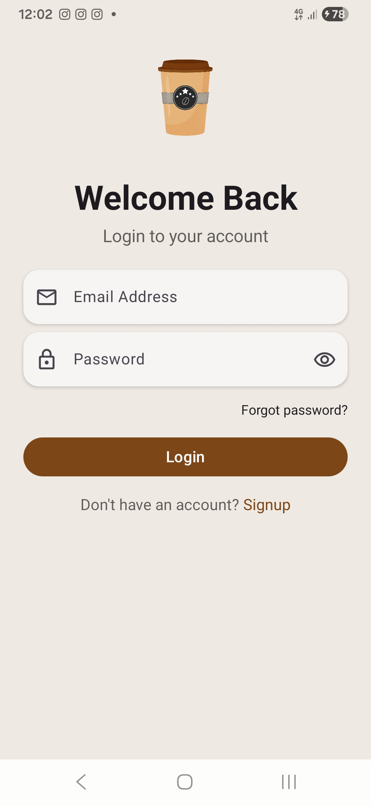
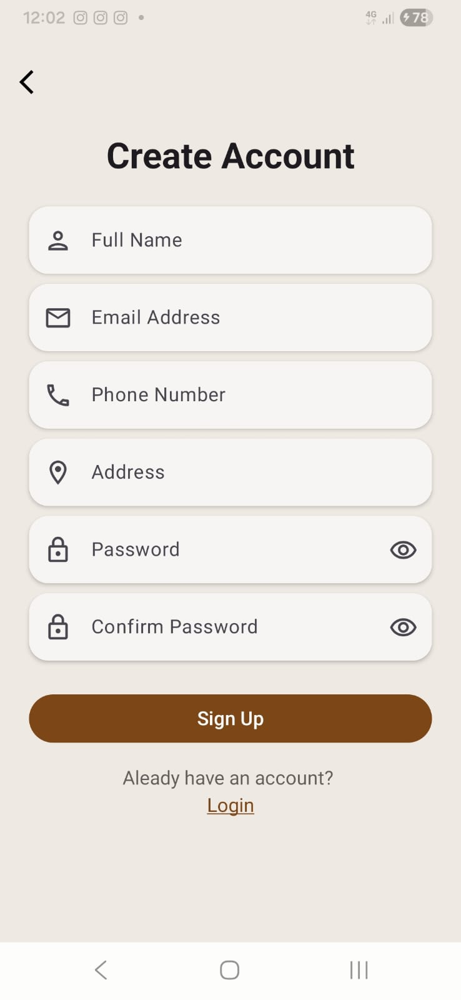
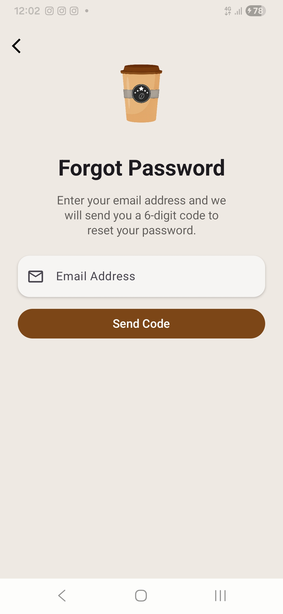
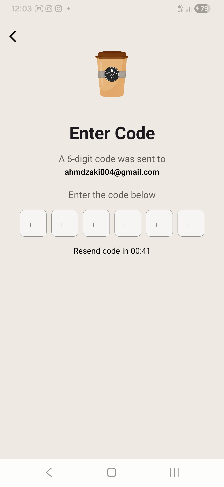
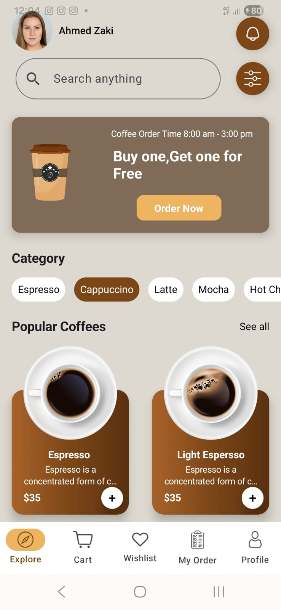
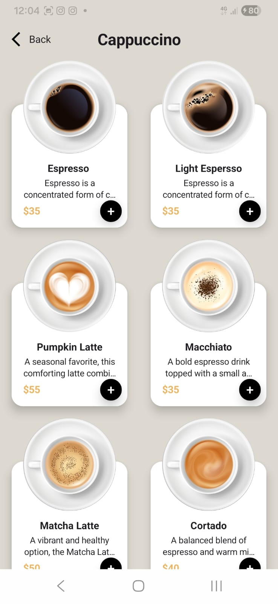
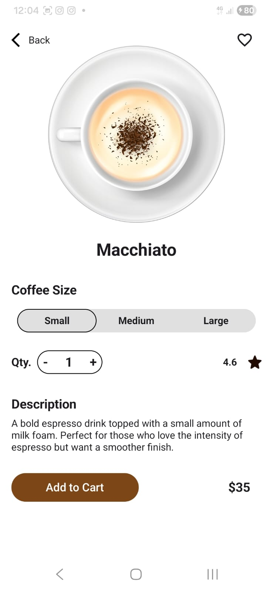
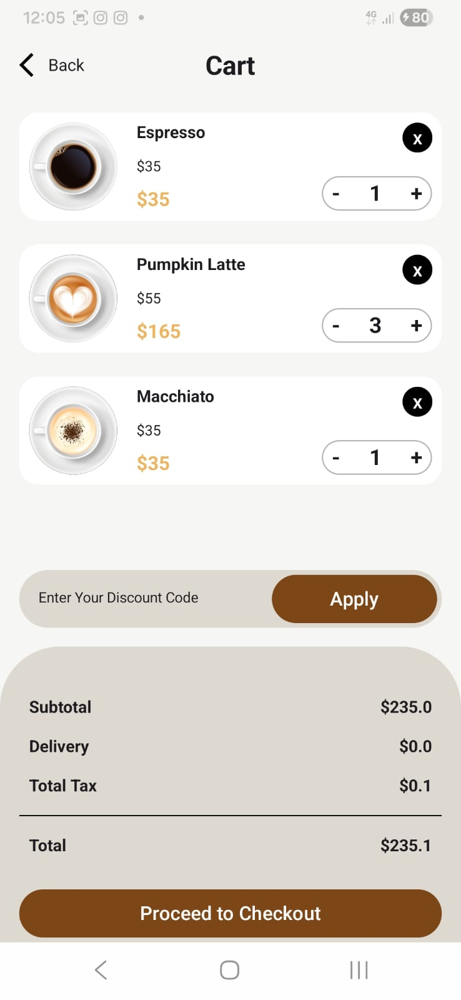
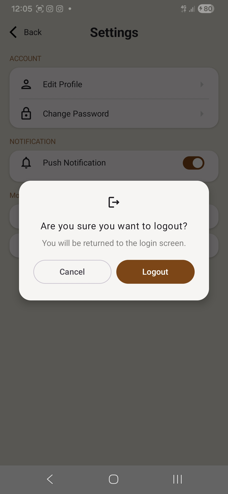

# Cafee Andorid App

## Table of contents
* [General info](#general-info)
* [Screenshots](#screenshots)
* [Functionality](#functionality)
* [Technologies](#technologies)
* [Setup](#setup)
* [License](#license)

## General info

Café App is a modern mobile application designed to enhance the coffee ordering experience. Users can easily browse a dynamic menu, view detailed product information, customize their orders, and place them through a smooth and intuitive interface.

## Screenshots

 
 

 
 
 
 
 

## Functionality

* User Authentication:
  A secure authentication system that enables users to create new accounts and log in efficiently, ensuring their data and activity are safely managed.

* Password Recovery via OTP:
  Users can recover their accounts through a secure OTP (One-Time Password) verification process, providing a reliable and user-friendly way to reset forgotten passwords.

* Menu Browsing by Categories:
  The application provides a well-structured menu divided into clear categories, allowing users to quickly explore available items, view details, and make selections without friction.

* Cart Management:
  Users can easily add items to the cart, update quantities, or remove products with a seamless and responsive experience. The cart dynamically calculates totals and reflects changes in real time to ensure accuracy and convenience.
 
* Payment Gateway Integration (Paymob):
  The app integrates with the Paymob payment gateway to support secure and smooth online transactions, offering users a trusted checkout experience.

## Technologies

#### Languages:
- Kotlin 

#### User interface structure:
- Jetback Compose

#### Architecture patterns:
- MVI, I choose mvi for better sperations of concern. each layer can handle it's purpose efficiency. model is data layer which contains business logic, view is ui layer and it's responsability for render ui only and the last is intent. intent which means user action on the screen.
- 
#### Libraries:
- Constraint Layout: Flexible and responsive UI design system for complex layouts.
- Hilt:              Dependency injection library for simpler and scalable code management.
- DataStore:         Modern data storage solution for handling key-value data efficiently.
- Retrofit:          Type-safe HTTP client for seamless API communication.
- Coil:              Lightweight image loading library optimized for Android.
- Paging 3:          Efficient pagination library for loading large datasets smoothly.

## Setup

- To run this project, install it by download or clone.

#### System requirements
- Android Studio Panda 2 | 2025.3.2 or above
- Minimum sdk v24
- Target sdk v36
- Compile sdk v36

## License

```html
MIT Licence 

Copyright (c) 2026 Ahmed Zaki

Permission is hereby granted, free of charge, to any person obtaining a copy of this software
and associated documentation files (the "Software"), to deal in the Software without restriction,
including without limitation the rights to use, copy, modify, merge, publish, distribute, sublicense,
and/or sell copies of the Software, and to permit persons to whom the Software is furnished to do so, 
subject to the following conditions:

The above copyright notice and this permission notice shall be included in all copies or substantial 
portions of the Software.

THE SOFTWARE IS PROVIDED "AS IS", WITHOUT WARRANTY OF ANY KIND, EXPRESS OR IMPLIED, 
INCLUDING BUT NOT LIMITED TO THE WARRANTIES OF MERCHANTABILITY, FITNESS FOR A PARTICULAR PURPOSE
AND NONINFRINGEMENT.IN NO EVENT SHALL THE AUTHORS OR COPYRIGHT HOLDERS BE LIABLE FOR ANY CLAIM,
DAMAGES OR OTHER LIABILITY, WHETHER IN AN ACTION OF CONTRACT,
TORT OR OTHERWISE, ARISING FROM, OUT OF OR IN CONNECTION WITH THE SOFTWARE
OR THE USE OR OTHER DEALINGS IN THE SOFTWARE.
```
